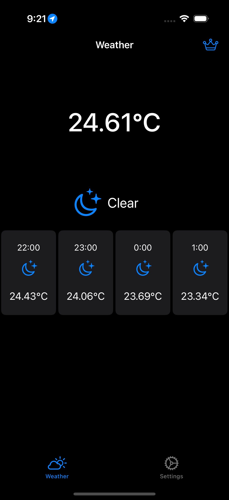
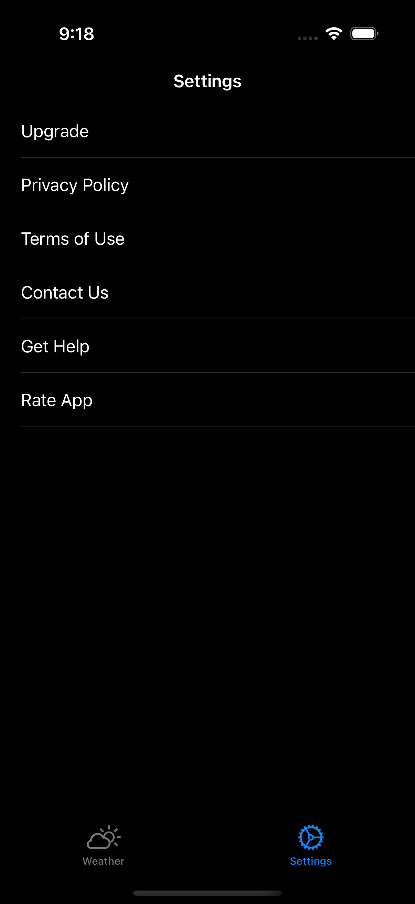
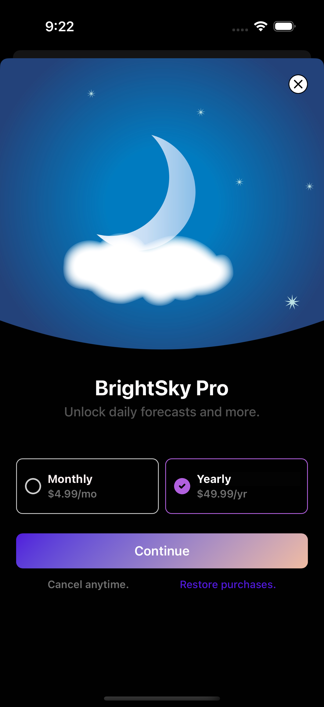
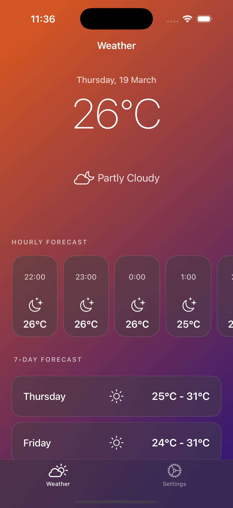

# BrightSky

**BrightSky** is a modern iOS weather application built with **Swift** and **Apple’s WeatherKit**, delivering accurate current, hourly, and daily forecasts based on the user’s location.  
The app is designed with a **clean MVVM-style architecture**, leverages **compositional collection view layouts**, and integrates a **subscription model** using **RevenueCat**.

BrightSky showcases real-world iOS development practices including system frameworks, asynchronous data handling, and in-app purchase workflows.

---

## 📱 App Overview

BrightSky provides a fast and visually polished way to view weather conditions tailored to the user’s current location.  
Core weather information is available to all users, while premium features such as the **daily forecast** are unlocked via subscription.

The project focuses on maintainability, scalability, and modern UIKit patterns suitable for production-grade applications.

---

## ✨ Key Features

- 🌤 **Current Weather**  
  Displays temperature, conditions, and system weather icons.

- 🕒 **Hourly Forecast**  
  Horizontally scrolling hourly forecast built with compositional layouts.

- 📅 **Daily Forecast (Premium)**  
  Available exclusively to subscribed users.

- 📍 **Location-Based Weather**  
  Uses `CoreLocation` to automatically fetch the user’s current location.

- 💳 **In-App Subscriptions**  
  Subscription handling powered by **RevenueCat** and **RevenueCatUI**.

- ⚙️ **Settings Screen**  
  Includes upgrade flow, privacy policy, contact options, and extensibility points.

- 🧠 **MVVM-Style Architecture**  
  View models drive each section and cell for clean separation of concerns.

- 🧩 **Compositional Layouts**  
  Flexible and scalable collection view sections.

---

## Screenshots

<table align="center">
  <tr>
    <td align="center">
       
      <b>Main Screen</b>
    </td>
    <td align="center">
       
      <b>Settings Screen</b>
    </td>
  </tr>
  <tr>
    <td align="center">
       
      <b>Subscription Screen</b>
    </td>
    <td align="center">
       
      <b>After Subscription Screen</b>
    </td>
  </tr>
</table>

## 🏗️ Architecture Overview

- UIKit-based UI with compositional collection views  
- MVVM-style separation using dedicated view models  
- Centralized managers for weather, location, and subscriptions  
- Reactive UI updates driven by async data fetching  

---

## 🛠️ Tech Stack & Requirements

- **Language:** Swift 5.9  
- **UI Framework:** UIKit  
- **Weather API:** WeatherKit  
- **Location:** CoreLocation  
- **Subscriptions:** RevenueCat, RevenueCatUI  
- **Minimum iOS Version:** iOS 17.0+  
- **Xcode:** 15+

---

📱 App Flow

1. App requests location permission on launch.
2. Weather data is fetched asynchronously via WeatherManager.
3. UI is rendered using compositional collection view sections.
4. Tapping the crown icon presents the RevenueCat paywall.
5. Upon successful subscription:
6. Daily forecast section becomes visible.
7. Paywall entry point is removed.
8. Settings screen provides static navigation options for future expansion.

🔍 Code Highlights

- LocationManager – Asynchronous location handling
- WeatherManager – Wrapper around WeatherService.shared
- IAPManager – Subscription state management via RevenueCat
- Custom collection view cells:
1.  CurrentWeatherCollectionViewCell
2.  HourlyWeatherCollectionViewCell
3.  DailyWeatherCollectionViewCell
- WeatherViewModel enum drives compositional layout sections
